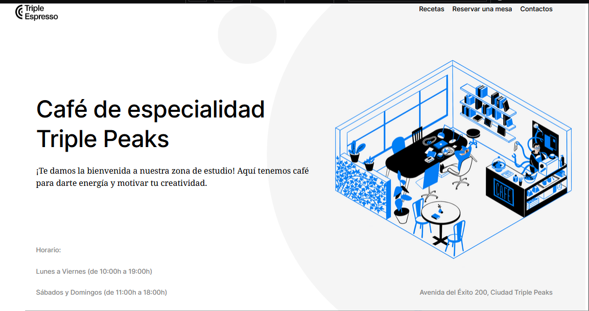
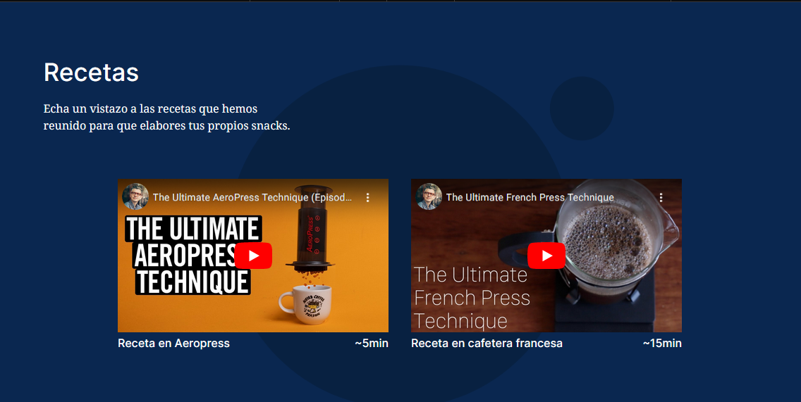
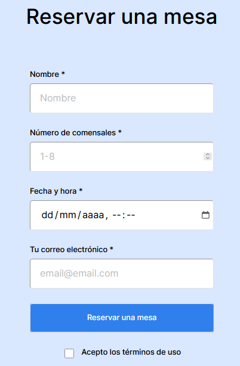
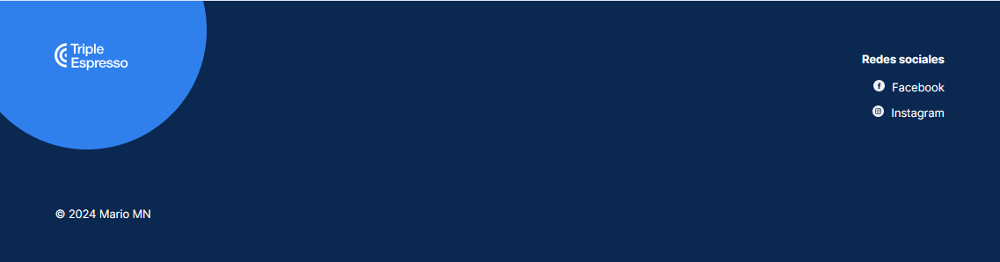

# Triple Espresso

## Página web orientada a a la venta y consumo de café, en dondé el cliente puede contactarnos y reservar un mesa

## El proyecto esta conformado por la siguientes secciones:

1. Sección header:

   

   Este apartado representa los datos generales, como el horario y links que dirijen a las demás secciones.

   Al haber realizado el encabezado me permitio mejorar mis habilidades con flex y entender mejor la diferencia entre el padding y margin.

   Lo más importante fue entender más la metodología BEM, ya que gracias a esta pude resolver en como posicionar las etiquetas 
, las cuáles contienen la dirección y el horario.

2. Sección recipes:

Esta parte me ayudo mucho a aprender más acerca de los <inframes>, y sus respectivas propiedades este caso fueron dos videos de youtube, también utilize flexbox conjuntamente con la etiqueta  para poder separar los minutos del video con el texto.

3. Sección forms:

Gracias a la elaboración de este formulario, me ayudo a mejorar algunas cosas que no entendia, como:

- Utilizar flexbox con formulario.

- Identificar los <inputs> con sus atributos

- Utilizar un modificador de acuerdo con la metodología BEM para cambiar el color de fuente del "input type date"

- Alinear la etiqueta <label> "Acepto los términos de uso" con su checkbox.

La parte en la que tuve dificultades fue en alinear los nombres de la etiqueta <label> con su respectivo <input>, y al final lo pude resolver con flexbox asignando dicha propiedad al bloque . reservation y al .form\_\_fieldset

4. Sección footer:

La última sección fue muy completa, porque aprendí a como importar bloques (BEM) en archivos css distintos, lo cuál permite que tenga un código más ordenado, también pueda consultar clases más rápido y reutilizarlas.

Tuve dificultades con el el div class footer\_\_circle, porque no encontraba la manera de acomodarlo con z-index, y en consecuencia el circulo le sobraba un espacio fuera de la página. Para resolverlo recorde lo que había aprendido hasta el momento, y utilizé la propiedad overflow: hidden; y sirvio para que el espacio extra se eliminará.

## Tecnologías utilizadas:

&nbsp;
&nbsp;

## Enlace Pages:
# https://melomario57.github.io/web_project_coffeeshop/
## Aréas de mejora:

- Agregar artículos de recetas utilizando otras funciones de CSS, por ejemplo css grid.

- Agregar una sección de imágenes de los productos en venta e información.

- Agregarle funcionalidades al formulario mediante Javascript.

- El formulario tenga estilos en los botones y checkbox, además agregar algunos radio buttons
